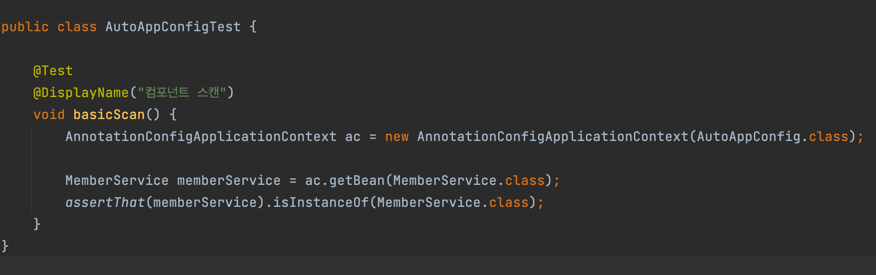
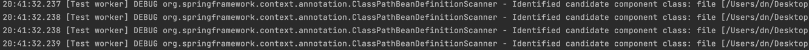
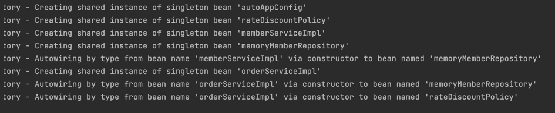
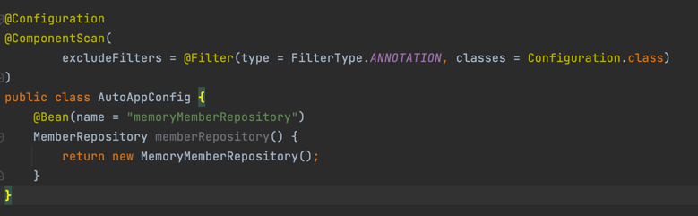

## 컴포넌트 스캔과 의존관계 자동 주입
- 지금까지 스프링 빈을 등록할 때는 자바코드의 @Bean이나 XML의 <bean> 등을 이용해서 설정 정보에 직접 등록할 스프링 빈을 나열함
- 이렇게 등록하다보면 일일이 등록하기 힘들고 설정 정보도 커지고 누락 문제가 발생할 수 있음
- 스프링은 설정 정보가 없어도 자동으로 스프링 빈을 등록하는 컴포넌트 스캔 기능을 제공함
- 의존관계를 자동으로 주입하는 @Autowired 기능도 제공함
---
- 컴포넌트 스캔을 사용하려면 먼저 @ComponentScan 을 설정정보에 붙여주면 됨
- 기존 AppConfig와 다르게 @Bean으로 등록한 클래스가 없음
---
- 컴포넌트 스캔은 @Component 어노테이션이 붙은 클래스를 스캔해서 스프링 빈으로 등록함
    - @Configuration이 컴포넌트 스캔 대상이 되는 것도 내부적으로 @Component가 붙어있음
    
---
- AppConfig와 다르게 자동으로 빈으로 등록이 되어버리기 때문에, MemberServiceImpl 같은 경우 MemberRepository 의존관계 주입을 해줄 수 없음
    - 생성자 위에 @Autowired로 자동으로 의존관계 주입 시킴
    - ac.getBean(MemberRepository.class) 같은 느낌으로 동작한다고 생각하면 됨.
    
- AppConfig를 사용할 때는 @Bean으로 직접 설정 정보를 작성했고 의존관계도 직접 명시했음. 이제는 설정 정보가 없기 때문에 의존 관계 주입도 클래스 안에서 해결해야 함

---

- AnnotationConfigApplicationContext를 사용하는 것은 동일함
- 설정 정보로 AutoAppConfig를 넘겨줌

- 로그를 보면 컴포넌트 스캔이 돌고 있는 것을 볼 수 있음

- 싱글톤 정보와 의존관계 자동 주입에 관한 내용도 볼 수 있음
---
### @ComponentScan
- @ComponentScan은 @Component가 붙은 모든 클래스를 스프링 빈으로 등록한다.
  - 이때 스프링 빈의 기본 이름은 클래스명을 사용하되, 맨 앞글자만 소문자를 사용한다.
    - 빈 이름 기본 전략: MemberServiceImpl => memberServiceImpl
    - 빈 이름 직접 지정: 만약 스프링 빈 이름을 직접 지정하고 싶으면 @Component("memberService2") 이름을 부여하면 된다.
    - ex) 빈 이름: memberServiceImple, 빈 객체: MemberServiceImpl@x01

### @Autowired
- 생성자에 @Autowired를 지정하면 스프링 컨테이너가 자동으로 해당 스프링 빈을 찾아서 주입
- 기본 조회 전략은 타입이 같은 빈을 찾아서 주입함
  - getBean(MemberRepository.class)와 동일하다고 이해하면 됨
  
---
## 탐색 위치와 기본 스캔 대상
#### 탐색 패키지 시작 위치 지정
- 모든 자바 클래스를 다 컴포넌트 스캔하면 시간이 오래 걸림. 꼭 필요한 위치부터 탐색하도록 시작 위치 지정 가능
```java
@ComponentScan(basePackages = "hello.core")
```
- basePackages: 탐색할 패키지 시작 위치 지정. 해당 패키지를 포함해서 하위 패키지를 모두 탐색
  - basePackages: { "hello.core", "hello.service" } 여러 시작 위치 지정 가능
  - basePackageClasses: 지정한 클래스의 패키지를 탐색 시작 위로 지정
  - 만약 지정하지 않으면 @ComponentScan이 붙은 설정 정보 클래스의 패키지가 시작 위치가 됨.
  
#### 권장하는 방법
- 패키지 위치를 지정하지 않고, 설정 정보 클래스 위치를 프로젝트 최상단에 두는 것 (스프링 부트 기본 제공)
  - ex. com.hello 프로젝트 시작루트에 메인 설정 정보를 두고 @ComponentScan 붙인 후 basepackages는 생략, 스프링부트의 시작 정보인 @SpringBootApplication 설정안에 @ComponentScan이 들어 있음!
  
#### 컴포넌트 스캔 대상
- @Component: 컴포넌트 스캔에서 사용
- @Controller: 스프링 MVC 컨트롤러에서 사용
- @Service: 스프링 비즈니스 로직에서 사용
- @Repository: 스프링 데이터 접근 계층에서 사용
- @Configuration: 스프링 설정 정보에서 사용

#### 애노테이션 부가 기능
- @Controller: 스프링 MVC 컨트롤러로 인식
- @Service: 특별한 처리X, 개발자들이 '핵심 비즈니스 로직이 여기 있겠구나'하고 인식할 수 있게 도움
- @Repository: 스프링 데이터 접근 계층으로 인식하고 데이터 계층의 예외를 스프링 예외로 반환
- @Configuration: 스프링 설정 정보로 인식하고 스프링 빈이 싱글톤을 유지하도록 추가 처리

useDefaultFilters 옵션은 기본적으로 켜져있는데, 이 옵션을 끄면 스캔 대상들이 제외됨.

### 필터
- includeFilters : 포함할 대상
- excludeFilters : 제외할 대상

#### FilterType
- ANNOTATION: 기본값, 애노테이션을 인식해서 동작함
  - ex) 'org.example.SomeAnnotation'
- ASSIGNABLE_TYPE: 지정한 타입과 자식 타입을 인식해서 동작
  - ex) 'org.example.SomeClass'
  ```java
  excludedFilters = {
    @Filter(type = FilterType.ASSIGNABLE_TYPE, classes = BeanA.class) 
  }
  ```
- ASPECTJ: AspectJ 패턴 사용
  - ex) 'org.example..*Service+'
- REGEX: 정규 표현식
  - ex) 'org\.example\.Default.*'
- CUSTOM: TypeFilter 라는 인터페이스 구현해서 처리
  - ex) 'org.examle.MyTypeFilter'
---
- @Component으로 거의 사용하고, includeFilters나 excludeFilters를 사용하진 않음 (기본 설정 사용 권장)

### 중복 등록
1. 자동 빈 등록 vs 자동 빈 등록
   - 컴포넌트 스캔에 의해 자동으로 빈 등록이 되는데, 이름이 같은 경우 스프링에서 오류 발생시킴
      - ConflictingBeanDefinitionException 발생
2. 수동 빈 등록 vs 자동 빈 등록

  - 이 경우, 수동 빈 등록이 우선권을 가짐 (수동 빈이 자동 빈을 오버라이딩 해버림)
  - 최근 스프링부트에서는 수동 빈, 자동 빈 등록이 충돌나면 오류가 발생하도록 기본 값을 바꿈
```java
Consider renaming one of the beans or enabling overriding by setting spring.main.allow-bean-definition-overriding=true
```
- 스프링부트인 CoreApplication 실행시 오류를 볼 수 있음
- overriding 허용하고 싶다면 resources/application.properties에 spring.main.allow-bean-definition-overriding=true 세팅