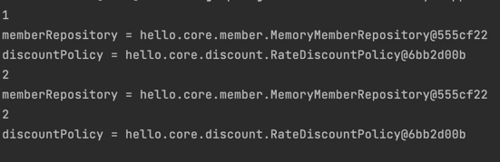
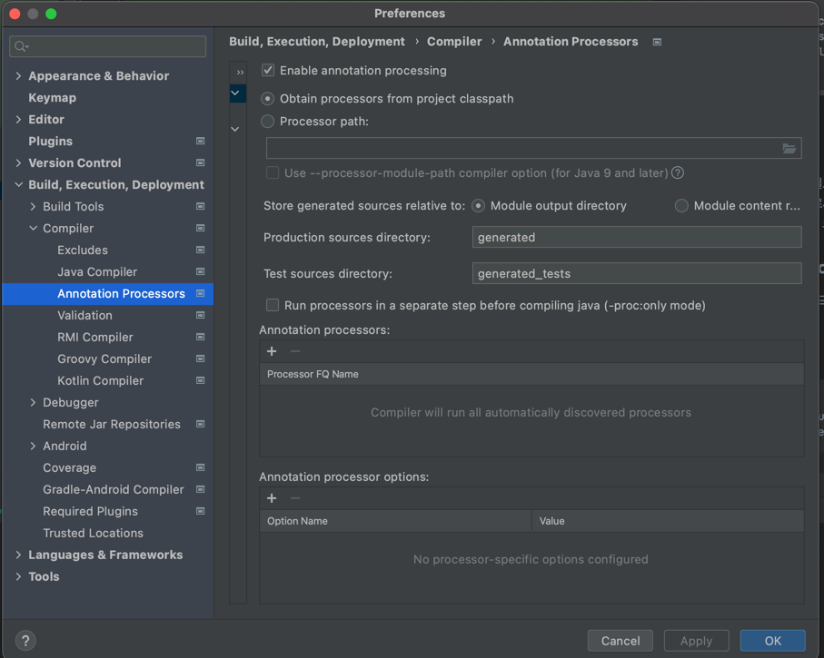

# 의존관계 자동 주입

## 의존관계 주입 방법
- 생성자 주입
- 수정자 주입 (setter 주입)
- 필드 주입
- 일반 메서드 주입

### 생성자 주입
- 이름 그대로 생성자를 통해서 의존 관계를 주입 받는 방법
- 특징
    - 생성자 호출시점에서 딱 1번만 호출되는 것이 보장됨
    - **불변, 필수** 의존관계에서 사용
  
```java
private final MemberRepository memberRepository;
private final DiscountPolicy discountPolicy;

@Autowired
public OrderServiceImpl(MemberRepository memberRepository, DiscountPolicy discountPolicy) {
    this.memberRepository = memberRepository;
    this.discountPolicy = discountPolicy;
}
```

- *생성자가 딱 1개만 있으면 @Autowired를 생략해도 자동 주입됨. 스프링 빈에만 해당
```java
private final MemberRepository memberRepository;
private final DiscountPolicy discountPolicy;

public OrderServiceImpl() {
    
}

public OrderServiceImpl(MemberRepository memberRepository, DiscountPolicy discountPolicy) {
    this.memberRepository = memberRepository;
    this.discountPolicy = discountPolicy;
}
```
- 이 경우에는 생성자가 2개이므로 하나에는 @Autowired 설정해줘야 함

### 수정자 주입
- setter라 불리는 필드의 값을 변경하는 수정자 메서드를 통해 의존관계 주입하는 방식
- 특징
  - **선택, 변경** 가능성이 있는 의존관계에 사용
  - 자바 빈 프로퍼티 규약의 수정자 메서드 방식을 사용하는 방법
  
- @Autowired 기본 동작은 주입할 대상이 없으면 오류 발생
- 주입할 대상이 없어도 동작하게 하려면 @Autowired(required = false) 지정해주면 됨

```java
private MemberRepository memberRepository;
private DiscountPolicy discountPolicy;

@Autowired
public void setMemberRepository(MemberRepository memberRepository) {
    System.out.println("memberRepository = " + memberRepository);
    this.memberRepository = memberRepository;
}

@Autowired
public void setDiscountPolicy(DiscountPolicy discountPolicy) {
    System.out.println("discountPolicy = " + discountPolicy);
    this.discountPolicy = discountPolicy;
}
```
스프링 실행시 2단계로 나뉘어져 있음
1. 스프링 빈 등록
2. 연관관계 주입 (이 때, autowired 보고 주입 시킴)

- 결국 자바에서 생성자 호출이 먼저 일어나기 때문에 생성자 주입 후, 수정자 주입이 일어남

  
---

### 필드 주입
```java
@Autowired
private MemberRepository memberRepository;

@Autowired
private DiscountPolicy discountPolicy;
```
- 생성자 없이 필드에 @Autowired만 붙여줘도 주입 가능
- 이름 그대로 필드에 바로 주입하는 방법
- 특징
  - 코드가 간결하지만 외부에서 변경이 불가능해서 테스트하기 힘들다는 치명적인 단점 존재
  - DI 프레임워크가 없으면 아무것도 할 수 없음
  - 사용 가능한 경우
    - 애플리케이션의 실제 코드와 관계 없는 테스트 코드
    - 스프링 설정을 목적으로 하는 @Configuration같은 곳에서만 특별한 용도로 사용
  
### 일반 메서드 주입
- 일반 메서드를 통해 주입
- 특징
  - 한번에 여러 필드를 주입 받을 수 있음
  - 일반적으로 거의 사용하지 않음
```java
private MemberRepository memberRepository;
private DiscountPolicy discountPolicy;

@Autowired
public void init(MemberRepository memberRepository, DiscountPolicy discountPolicy) {
    this.memberRepository = memberRepository;
    this.discountPolicy = discountPolicy;
}
```
---
- 의존관계 자동 주입은 스프링 컨테이너가 관리하는 스프링 빈이어야 동작한다. 스프링 빈이 아닌 Member 같은 클래스에서 @Autowired 적용해도 아무 기능도 동작하지 않는다.

## 옵션 처리
- 주입할 스프링 빈이 없어도 동작해야할 때가 있음
- @Autowired만 사용하면 required 옵션의 기본값이 true로 되어있어서 자동 주입 대상이 없으면 오류가 발생
---
- @Autowired(required = false) : 자동 주입할 대상이 없으면 수정자 메서드 자체가 호출 안됨
- org.springframework.lang.@Nullable : 자동 주입할 대상이 없으면 null 입력
- Optional<> : 자동 주입할 대상이 없으면 Optional.empty 입력

```java
package hello.core.autowired;

import hello.core.member.Member;
import org.junit.jupiter.api.Test;
import org.springframework.beans.factory.annotation.Autowired;
import org.springframework.context.ApplicationContext;
import org.springframework.context.annotation.AnnotationConfigApplicationContext;
import org.springframework.lang.Nullable;

import java.util.Optional;

public class AutowiredTest {

  @Test
  void AutowiredOption() {
    ApplicationContext ac = new AnnotationConfigApplicationContext(TestBean.class);
  }

  static class TestBean {
      
    // 자동 주입할 대상이 없으므로 호출 X
    @Autowired(required = false)
    public void setNoBean1(Member noBean1) {
      System.out.println("noBean1 = " + noBean1);
    }

    // 자동 주입할 대상 없으면 null
    @Autowired
    public void setNoBean2(@Nullable Member noBean2) {
      System.out.println("noBean2 = " + noBean2);
    }

    // 자동 주입할 대상 없으면 Optional.empty
    @Autowired
    public void setNoBean3(Optional<Member> noBean3) {
      System.out.println("noBean3 = " + noBean3);
    }
  }
}

```

## 생성자 주입을 선택하라!
- 과거에는 수정자 주입과 필드 주입을 많이 사용했지만 최근에는 스프링을 포함한 DI 프레임워크 대부분이 생성자 주입을 권장

**불변**
- 대부분 의존관계 주입은 한번 일어나면 애플리케이션 종료시점까지 의존관계를 변경할 일이 없음. 오히려 대부분의 의존관계는 애플리케이션 종료 전까지 불변해야한다.
- 수정자 주입을 사용하면 setXxx 메서드를 public으로 열어두어야 함
- 누군가 실수로 변경할 수도 있고, 변경하면 안되는 메서드를 열어두는 것은 좋은 설계방법이 아님
- 생성자 주입은 객체를 생성할 때, 1번만 호출되므로 이후에 호출되는 일이 없음. (불변하게 설계 가능)

**누락**
- 프레임워크 없이 순수한 자바코드를 단위 테스트하는 경우에
```java
public class OrderServiceImpl implements OrderService {
    private MemberRepository memberRepository;
    private DiscountPolicy discountPolicy;
    
    @Autowired
    public void setMemberRepository(MemberRepository memberRepository) {
        this.memberRepository = memberRepository;
    }

  @Autowired
  public void setDiscountPolicy(DiscountPolicy discountPolicy) {
    this.discountPolicy = discountPolicy;
  }
}
```
- @Autowired가 프레임워크 안에서 동작할 때는 의존관계가 없으면 오류가 발생하지만, 지금은 프레임워크 없이 순수한 자바 코드로만 단위 테스트를 수행하고 있음

- 생성자 주입을 쓰면 final 키워드를 넣을 수 있음
  - final을 넣어주면 컴파일 단계에서 생성자에 혹시라도 값이 설정되지 않은 오류를 걸러줄 수 있음

**정리**
- 생성자 주입 방식은 프레임워크에 의존하지 않고, 순수한 자바 언어 특징을 잘 살리는 방법이기도 함
- 기본으로 생성자 주입을 사용하고 필수값이 아닌 경우 수정자 주입 방식을 옵션으로 부여하면 됨. 생성자 주입과 수정자 주입을 동시에 사용할 수 있음
- 필드주입은 X

---
## 롬복 / 최신 트렌드
- 개발해보면 대부분 불변이고 생성자에 final 키워드를 사용하게 됨
- 생성자도 만들고, 주입 받은 값을 대입하는 코드도 만들어야 하는 불편함이 있음

1. 기본 코드
```java
@Component
public class OrderServiceImpl implements OrderService {

  private final MemberRepository memberRepository;
  private final DiscountPolicy discountPolicy;

  @Autowired
  public OrderServiceImpl(MemberRepository memberRepository, DiscountPolicy discountPolicy) {
    this.memberRepository = memberRepository;
    this.discountPolicy = discountPolicy;
  }
```

2. 생성자가 1개라면 @Autowired 생략 가능
```java
@Component
public class OrderServiceImpl implements OrderService {

  private final MemberRepository memberRepository;
  private final DiscountPolicy discountPolicy;

  public OrderServiceImpl(MemberRepository memberRepository, DiscountPolicy discountPolicy) {
    this.memberRepository = memberRepository;
    this.discountPolicy = discountPolicy;
  }
```
## Lombok
- build.gradle에 추가 필요


- 자바의 애노테이션 프로세서라는 기능을 이용해서 컴파일 시점에 생성자 코드를 자동으로 생성해줌. 실제 class를 열어보면 코드가 추가되어 있음

### @RequiredArgsConstructor
- final 키워드가 붙은 필드를 모아서 생성자를 자동으로 만들어줌 (코드에서는 보이지 않지만 실제 호출 가능)

3. Lombok 사용

```java
@Component
@RequiredArgsConstructor
public class OrderServiceImpl implements OrderService {

    private final MemberRepository memberRepository;
    private final DiscountPolicy discountPolicy;
```

**정리**
- 최근에는 생성자를 딱 1개만 두고 @Autowired를 생략하는 방법을 주로 사용. 여기에 Lombok 라이브러리의 @RequiredArgsConstructor 를 함께 사용하면 기능은 다 제공하면서 코드는 깔끔하게 사용할 수 있음.


## 조회한 빈이 모두 필요한 경우 List, Map