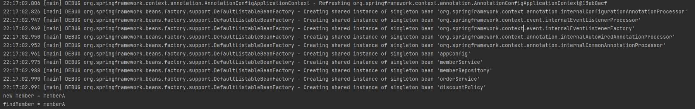

### 제어의 역전 IoC(Inversion of Control)
- (간단히, 내가 아닌 프레임워크가 대신 호출해주는 것)

=> 프로그램 제어 흐름을 직접하는 게 아니라 외부에서 관리하는 것

- 기존 프로그램은 클라이언트 구현 객체가 스스로 필요한 서버 구현 객체를 **[생성, 연결, 실행]** 했음. => 구현객체가 프로그램의 제어 흐름을 스스로 조종
- AppConfig 등장 이후 구현 객체는 자신의 로직을 **[실행]** 하는 역할만 담당. 프로그램 제어 흐름은 AppConfig가 담당하게 됨.
  (OrderServiceImpl조차 AppConfig에서 생성)
---

#### '프레임워크 vs 라이브러리'
- 프레임워크가 내가 작성한 코드를 제어, 실행한다면 프레임워크
- 내가 작성한 코드가 제어 흐름을 직접 담당한다면 라이브러리

---

### 의존관계 주입 DI (Dependency Injection)
- OrderServiceImpl은 DiscountPolicy 인터페이스에 의존함. (실제 어떤 구현 객체가 사용될지 모름)
- 의존관계는 **"정적인 클래스 의존관계와 실행 시점에 결정되는 동적 객체(인스턴스) 의존관계"** 를 분리해서 생각해야 함.

#### 정적인 클래스 의존관계
- 클래스가 사용하는 import코드를 보고 의존관계를 판단 가능함
- 애플리케이션을 실행하지 않더라도 분석 가능
- 클래스 의존관계 만으로는 실제 어떤 객체가 주입될지는 알지 못함

#### 동적인 객체 인스턴스 의존관계
- 애플리케이션 실행 시점에 실제 생성된 객체 인스턴스의 참조가 연결된 의존관계
- 실행 시점(런타임)에 외부에서 실제 구현 객체를 생성하고 클라이언트에 전달해서 클라이언트와 서버의 실제 의존관계가 연결되는 것 => 의존관계 주입
- 객체 인스턴스를 생성하고, 그 참조 값을 전달해서 연결함
- DI를 사용하면
  - 클라이언트 코드를 변경하지 않고, 클라이언트가 호출하는 대상의 타입 인스턴스를 변경할 수 있음
  - 정적인 클래스 의존관계를 변경하지 않고, 동적인 객체 인스턴스 의존관계를 쉽게 변경할 수 있음

#### IoC 컨테이너, DI 컨테이너
- AppConfig처럼 객체를 **생성**하고 **관리**하면서 **의존관계를 연결**해주는 것을 IoC 컨테이너 or **DI 컨테이너**라고 함.
  (의존관계 주입에 초점을 맞춰, 주로 DI 컨테이너라고 함)
- 어셈블러, 오브젝트 팩토리 등으로 불리기도 함.

#### ApplicationContext

- @Bean으로 스프링 컨테이너에 등록

#### 스프링 컨테이너
- ApplicationContext를 스프링 컨테이너라고 함
- 기존에는 개발자가 AppConfig를 사용해서 직접 객체를 생성하고 DI를 했지만, 스프링 컨테이너를 통해 가능함
- 스프링 컨테이너는 @Configuration이 붙은 AppConfig를 설정(구성)정보로 사용함
  - @Bean 어노테이션이 붙은 메서드를 모두 호출해서 반환된 객체를 스프링 컨테이너에 등록함 (스프링 컨테이너에 등록된 객체를 스프링 빈이라고 함)
- 스프링 빈은 @Bean 어노테이션이 붙은 메서드명을 그대로 스프링 빈 이름으로 사용함
- 스프링 빈은 applicationContext.getBean() 메서드를 사용해서 찾을 수 있음

#### 스프링 빈 조회 - 상속관계
- 부모 타입으로 조회시 자식 타입도 함께 조회됨
- 자바 객체의 최고 부모인 Object 타입으로 조회하면 모든 스프링 빈을 조회함

### BeanFactory, ApplicationContext
- AnnotationConfig, AnnotationContext -> ApplicationContext<<interface>> -> BeanFactory<<interface>>

#### BeanFactory
- 스프링 컨테이너 최상위 인터페이스
- 스프링 빈을 관리하고 조회하는 역할 담당
- getBean() 제공

#### ApplicationContext
- BeanFactory 기능을 모두 상속받아서 제공
- 애플리케이션을 개발할 때는 빈은 관리하고 조회하는 기능은 물론, 많은 부가기능이 필요함
  - MessageSource: 메시지 소스를 활용한 국제화 기능
  - EnvironmentCapable: 로컬, 개발, 운영 구분 처리
  - ApplicationEventPublisher: 이벤트 발행하고 구독하는 모델을 편리하게 지원
  - ResourceLoader: 파일, 클래스패스, 외부 등에서 리소스를 편리하게 조회

- ApplicationContext 는 BeanFactory 기능을 상속받음
- ApplicationContext 는 빈 관리기능, 편리한 부가 기능 제공
- BeanFactory 를 직접 사용할 일은 거의 없음. 부가기능 포함된 ApplicationContext 사용
- BeanFactory 나 ApplicationContext를 스프링 컨테이너라고 함

#### 스프링 빈 설정 메타 정보 - BeanDefinition
- 스프링의 다양한 설정 형식 지원이 가능한 이유는 BeanDefinition이라는 추상화가 있기 때문
- **"역할과 구현을 개념적으로 나눈 것"**
  - XML을 읽어서 BeanDefinition 으로 만듦
  - 자바 코드를 읽어서 BeanDefinition 으로 만듦
  - 스플이 컨테이너는 자바코드인지 XML인지 알 필요 없음. BeanDefinition 만 알면 됨.
- BeanDefinition 을  빈 설정 메타정보라고 함
  - @Bean, <bean> 당 각각 하나씩 메타정보가 생성됨
- 스프링 컨테이너는 메타정보를 기반으로 스프링 빈을 생성함

- AnnotationConfigApplicationContext 는 AnnotationDBeanDefinitionReader 를 사용해서 AppConfig.class 를 읽고 BeanDefinition 생성
- 새로운 형식의 설정 정보가 추가되면 XxxBeanDefinitionReader를 만들어서 BeanDefinition를 생성하면 됨

- BeanDefinition 를 직접 생성해서 스프링 컨테이너에 등록할 수도 있지만 그럴 일은 거의 없음
- 기본적으로 FactoryBean을 통해서 등록함