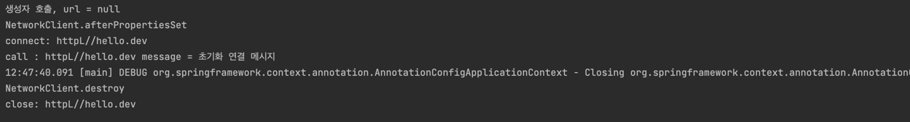
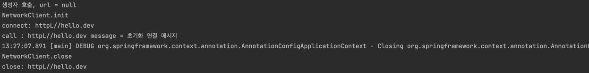

# 빈 생명주기 콜백

## 빈 생명주기 콜백 시작
- 데이터베이스 커넥션 풀이나 네트워크 소켓처럼 애플리케이션 시작 지점에서 필요한 연결을 미리 해두고, 애플리케이션 종료 시점에 연결을 모두 종료하는 작업을 진행하려면 객체 초기화와 종료 작업이 필요함.

```java
public class BeanLifeCycleTest {

    @Test
    public void lifeCycleTest() {
        ConfigurableApplicationContext ac = new AnnotationConfigApplicationContext(LifeCycleConfig.class);
        NetworkClient networkClient = ac.getBean(NetworkClient.class);
        ac.close();
    }

    @Configuration
    static class LifeCycleConfig {
        
        @Bean
        public NetworkClient networkClient() {
            NetworkClient networkClient = new NetworkClient();
            networkClient.setUrl("httpL//hello.dev");
            return networkClient;
        }
    }
}
```

```java
public class NetworkClient {

    private String url;

    public NetworkClient() {
        System.out.println("생성자 호출, url = " + url);
        connect();
        call("초기화 연결 메시지");
        disconnect();
    }

    public void setUrl(String url) {
        this.url = url;
    }

    // 서비스 시작 호출
    private void connect() {
        System.out.println("connect: " + url);
    }

    public void call(String message) {
        System.out.println("call : " + url + " message = " + message);
    }

    // 서비스 종료시 호출
    public void disconnect() {
        System.out.println("close: " + url);
    }
}
```

생성자 부분을 보면 url 정보 없이 connect()가 호출되고 있음
객체를 생성하는 단계에서 url이 없고, 객체를 생성한 다음에 외부에서 수정자 주입을 통해 setUrl()이 호출되어야 url이 존재하게 됨

**스프링 빈 라이프사이클**
1. 객체 생성
2. 의존관계 주입

스프링 빈은 객체를 생성하고 의존관계 주입이 다 끝난 후에 필요한 데이터를 사용할 수 있는 준비가 완료됨.
따라서 초기화 작업은 의존관계 주입이 모두 완료되고 난 다음에 호출해야 함. 

##### (개발자가 의존관계 주입이 모두 완료된 시점을 어떻게 알 수 있을까?)
=> 스프링은 의존관계 주입이 완료되면 스프링 빈에게 콜백 메서드를 통해서 초기화 시점을 알려주는 다양한 기능을 제공함.
스프링은 스프링 컨테이너가 종료되기 직전에 소멸 콜백을 줌 (안전한 종료 작업 가능)

**스프링 빈 이벤트 라이프사이클**
1. 스프링 컨테이너 생성
2. 스프링 빈 생성 (생성자 주입시)
3. 의존관계 주입 (필드, 수정자 주입시)
4. 초기화 콜백
5. 사용
6. 소멸 전 콜백
7. 스프링 종료

초기화 콜백: 빈이 생성되고, 빈의 의존관계 주입이 완료된 후 호출
소멸 전 콜백: 빈이 소멸되기 직전에 호출

#### 생성자 주입시에 다 초기화해서 넣으면 안되나??
**객체의 생성과 초기화를 분리하자**
- 생성자는 필수 정보(파라미터)를 받고, 메모리를 할당해서 객체를 생성하는 책임을 가진다. 반면에 **초기화**는 이렇게 생성된 값들을 활용해서 외부 커넥션을 연결하는 등 **무거운 동작을 수행**한다. 생성자 안에서 무거운 초기화 작업을 함께 하는 것보다는 객체를 생성하는 부분과 초기화하는 부분을 명확하게 나누는 것이 **유지보수 관점에서 좋다**. 물론 초기화 작업이 내부 값들만 약간 변경하는 정도로 단순한 경우에는 생성자에서 한번에 다 처리하는 게 나을 수 있음.

# 스프링 빈 생명주기 콜백 3가지
- 인터페이스 (InitializingBean, DisposableBean)
- 설정 정보에 초기화 메서드, 종료 메서드 지정
- @PostConstruct, @PreDestroy 애노테이션 지원

## 1. 인터페이스 InitializingBean, DisposableBean
```java
public class NetworkClient implements InitializingBean, DisposableBean {

    private String url;

    public NetworkClient() {
        System.out.println("생성자 호출, url = " + url);
    }

    public void setUrl(String url) {
        this.url = url;
    }

    // 서비스 시작 호출
    private void connect() {
        System.out.println("connect: " + url);
    }

    public void call(String message) {
        System.out.println("call : " + url + " message = " + message);
    }

    // 서비스 종료시 호출
    public void disconnect() {
        System.out.println("close: " + url);
    }

    // 의존관계 주입이 끝나면 set 해줌
    @Override
    public void afterPropertiesSet() throws Exception {
        connect();
        call("초기화 연결 메시지");
    }

    // 빈이 종료될 때 호출됨
    @Override
    public void destroy() throws Exception {
        disconnect();
    }
}
```

- 초기화 메서드 주입 완료 후, afterPropertiesSet() 메서드 호출됨
- 스프링 컨테이너 종료가 호출되자 소멸 메서드 호출됨

 **InitialingBean**
- afterPropertiesSet() 메서드로 초기화 지원
- 의존관계 주입 후 호출됨

**DisposableBean**
- destroy() 메서드로 소멸 지원
- 스프링이 종료되어 컨테이너가 내려가기 직전에 호출됨

### 초기화, 소멸 인터페이스 단점
- 스프링 전용 인터페이스. (해당 코드가 스프링 전용 인터페이스에 의존하게 됨)
- 초기화, 소멸 메서드 이름을 변경할 수 없음
- 코드를 고칠 수 없는 외부 라이브러리에 적용할 수 없음.

(참고: 인터페이스를 사용하는 초기화, 종료 방법은 스프링 초창기 방법임. 이제는 거의 사용X)

## 2. 빈 등록 초기화, 소멸 메서드
- 설정 정보에 
```java
@Bean(initMethod = "init", destroyMethod = "close")
```
처럼 초기화, 소멸 메서드를 지정할 수 있음.

```java
public class BeanLifeCycleTest {

    @Test
    public void lifeCycleTest() {
        ConfigurableApplicationContext ac = new AnnotationConfigApplicationContext(LifeCycleConfig.class);
        NetworkClient networkClient = ac.getBean(NetworkClient.class);
        ac.close();
    }

    @Configuration
    static class LifeCycleConfig {

        @Bean(initMethod = "init", destroyMethod = "close")
        public NetworkClient networkClient() {
            NetworkClient networkClient = new NetworkClient();
            networkClient.setUrl("httpL//hello.dev");
            return networkClient;
        }
    }
}
```
- @Bean 애노테이션이 initMethod, destroyMethod 파라미터 추가

```java
public class NetworkClient {

    private String url;

    public NetworkClient() {
        System.out.println("생성자 호출, url = " + url);
    }

    public void setUrl(String url) {
        this.url = url;
    }

    // 서비스 시작 호출
    private void connect() {
        System.out.println("connect: " + url);
    }

    public void call(String message) {
        System.out.println("call : " + url + " message = " + message);
    }

    // 서비스 종료시 호출
    public void disconnect() {
        System.out.println("close: " + url);
    }

    public void init() {
        System.out.println("NetworkClient.init");
        connect();
        call("초기화 연결 메시지");
    }

    public void close() {
        System.out.println("NetworkClient.close");
        disconnect();
    }
}
```


- 메소드명으로 맵핑해서 사용
**설정 정보 사용 특징**
- 메서드명을 자유롭게 줄 수 있음
- 스프링 빈이 스프링 코드에 의존하지 않는다.
- 코드가 아니라 설정 정보를 사용하기 때문에 코드를 고칠 수 없는 외부 라이브러리에도 초기화, 종료 메서드를 적용할 수 있다.

**종료 메서드 추론**
- @Bean의 destroyMethod 속성에는 특별한 기능이 존재함
- 라이브러리는 대부분 close, shutdown 이라는 이름의 종료 메서드를 사용
- @Bean의 destroyMethod 는 기본값이 inferred (추론) 으로 등록되어 있음
- 이 추론 기능은 'close', 'shutdown' 라는 이름의 메서드를 자동으로 호출해줌 (이름 그대로 종료 메서드를 추론해서 호출)
- 따라서 직접 스프링 빈으로 등록하면 종료 메서드는 따로 적어주지 않아도 잘 동작함
- 추론 기능을 사용하기 싫다면 destroyMethod="" 지정하면 됨.

## 3. 애노테이션 @PostConstruct, @PreDestroy
```java
@PostConstruct
public void init() {
    System.out.println("NetworkClient.init");
    connect();
    call("초기화 연결 메시지");
}

@PreDestroy
public void close() {
    System.out.println("NetworkClient.close");
    disconnect();
}
```

**@PostConstruct, @PreDestroy 애노테이션 특징**
- 최신 스프링에서 가장 권장하는 방법
- 애노테이션 하나만 붙이면 되므로 매우 편리
- 패키지를 보면 'javax.annotation.PostConstruct'. 스프링에 종속적인 기술이 아니라 JSR-250 라는 자바 표준임. 따라서 스프링이 아닌 다른 컨테이너에서도 동작함.
- 컴포넌트 스캔과 잘 어울림
- 유일한 단점은 외부 라이브러리에는 적용하지 못함. 외부라이브러리를 초기화, 종료해야한다면 @Bean 기능 사용 권장

** 정리 **
- @PostConstruct, @PreDestroy 를 사용하자
- 코드를 고칠 수 없는 외부 라이브러리를 초기화, 종료해야 하면 @Bean의 initMethod, destroyMethod를 사용하자
